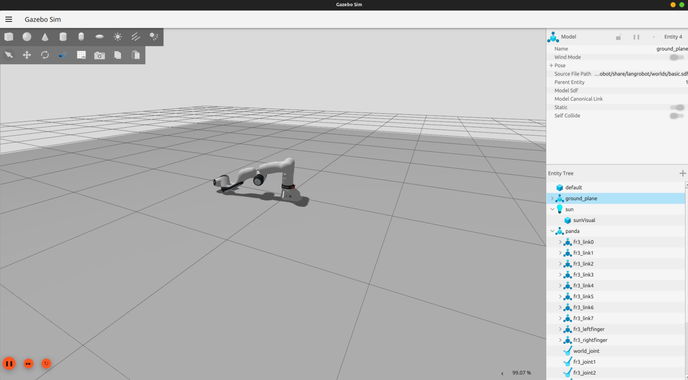

# Phase 1 Test Log

**Date:** <!-- e.g. 2026-04-11 -->  
**Machine:** Linux PC — AMD RX 7700 XT, Ubuntu 24.04  
**Branch/commit:** <!-- run: git log --oneline -1 -->

---

## Environment

| Item | Version / Status |
|------|-----------------|
| Ubuntu version | <!-- run: lsb_release -d --> |
| Kernel | <!-- run: uname -r --> |
| ROS2 version | <!-- run: ros2 --version --> |
| Gazebo version | <!-- run: gz sim --version --> |
| ROCm version | <!-- run: rocminfo \| grep "ROCm" \| head -1 --> |
| Ollama version | <!-- run: ollama --version --> |
| GPU detected | <!-- run: rocminfo \| grep gfx1100 --> |

---

## Test Results

### Test 1 — ROS2 environment
- [ ] PASS  [ ] FAIL

**Output of `ros2 --version`:**
```
<!-- paste here -->
```

---

### Test 2 — ROCm GPU detected
- [ ] PASS  [ ] FAIL

**Output of `rocminfo | grep gfx1100`:**
```
<!-- paste here -->
```

**Notes:**
<!-- anything unusual -->

---

### Test 3 — Ollama + Llama 3.2
- [ ] PASS  [ ] FAIL

**Output of `ollama list`:**
```
<!-- paste here -->
```

**Did inference test (`ollama run llama3.2 "Say hello in one word"`) respond?**
- [ ] Yes, within a few seconds
- [ ] Yes, but slowly (>30s) — GPU may not be active
- [ ] No / error

**Response was:**
```
<!-- paste here -->
```

---

### Test 4 — Colcon build
- [ ] PASS  [ ] FAIL

**Output of `colcon build --symlink-install` (last 10 lines):**
```
<!-- paste here -->
```

**Any errors?**
```
<!-- paste full error if any -->
```

---

### Test 5 — Unit tests (9 tests)
- [ ] All 9 PASSED  [ ] Some FAILED

**Output of `pytest tests/ -v`:**
```
<!-- paste here -->
```

---

### Test 6 — Gazebo launches with Franka arm
- [ ] Gazebo window opened
- [ ] Franka arm visible in scene
- [ ] controller_node log line appeared

**controller_node output (copy from Terminal 1):**
```
<!-- paste here -->
```

**Gazebo screenshot:**
<!-- Save screenshot as logs/phase1-gazebo-screenshot.png and reference it here -->
<!-- Example:  -->

**Any errors in Terminal 1?**
```
<!-- paste here -->
```

---

### Test 7 — Joint command
- [ ] PASS — controller_node logged the command
- [ ] PARTIAL — log appeared but arm didn't move in Gazebo (acceptable for Phase 1)
- [ ] FAIL — no log output

**controller_node output after sending joint command:**
```
<!-- paste here -->
```

**Output of `ros2 topic list | grep joint`:**
```
<!-- paste here -->
```

**Did the arm visibly move in Gazebo?**
- [ ] Yes  [ ] No (but log appeared — still a Phase 1 pass)

---

### Test 8 — Active nodes
- [ ] PASS  [ ] FAIL

**Output of `ros2 node list`:**
```
<!-- paste here -->
```

---

## Overall Phase 1 Result

- [ ] **PASSED** — all tests passed, proceeding to Phase 2
- [ ] **PASSED WITH ISSUES** — mostly working, see notes below
- [ ] **FAILED** — blocked on issue below

**Blocking issues (if any):**
<!-- Describe what's broken and paste the full error -->

**Non-blocking observations:**
<!-- Anything that worked but looked odd, was slower than expected, etc. -->

---

## What to do next

- If **PASSED**: commit this log and push — Phase 2 planning will begin
- If **PASSED WITH ISSUES**: commit the log anyway — the issues will be fixed in a patch before Phase 2
- If **FAILED**: commit the log with the full error — a fix will be issued

```bash
git add logs/phase1-test-log.md
git add logs/phase1-gazebo-screenshot.png   # if taken
git commit -m "test: Phase 1 verification results"
git push origin main
```
